# Malaysia Insurance Claims Workflow

> **Purpose**: Team reference document for understanding the end-to-end claim process in the True Claim Insight platform.

---

## System Status

| Component | Status | Port | Notes |
|-----------|--------|------|-------|
| **Video Service** | ✅ Working | 3002 | Daily.co integration complete |
| **Claimant PWA** | ✅ Working | 4001 | OTP login, submission, video |
| **Adjuster Portal** | ✅ Working | 4000 | Full case management |
| **Schedule Page** | ✅ Working | 4000/schedule | Session management |

---

## ⚠️ Important Terminology

> **Insurance Agent ≠ Loss Adjuster** — These are different roles!

| Role | **Insurance Agent** | **Loss Adjuster** |
|------|---------------------|-------------------|
| **Function** | Sells insurance policies | Assesses claims after incidents |
| **Licensed By** | Bank Negara Malaysia | MII (BCILLA) + AMLA |
| **Works For** | Insurance company/broker | Independent / Adjusting firm |
| **When Involved** | Before claim (policy sale) | After claim is filed |
| **In Our System** | ❌ Not a user | ✅ Primary user (ADJUSTER role) |

**Our platform serves Loss Adjusters (not insurance agents).**

---

## Primary Workflow: Standard Motor Claim Assessment

This is the **most common flow** in Malaysia, where the **Insurer appoints a Loss Adjuster** to assess the claim.

```mermaid
sequenceDiagram
    participant C as Claimant
    participant I as Insurer
    participant LA as Loss Adjuster
    participant S as System

    Note over C,I: 📱 INCIDENT OCCURS
    C->>I: Files claim with insurer (via call/app)
    C->>I: Sends photos of damage + police report
    
    Note over I,LA: 📋 ASSIGNMENT
    I->>S: Creates claim in system
    S->>S: Assigns claim number (CLM-XXXX)
    I->>LA: Appoints Loss Adjuster for assessment
    S->>LA: Notification: New case assigned

    Note over LA,C: 📹 VIDEO ASSESSMENT
    LA->>S: Opens Adjuster Portal
    LA->>S: Schedules video session with claimant
    S->>C: SMS notification with PWA link
    C->>S: Joins video call (PWA)
    LA->>C: Conducts remote walkthrough inspection
    LA->>S: Captures evidence, records session
    
    Note over LA,S: 📄 REPORT & RECOMMENDATION
    LA->>S: Generates assessment report
    LA->>S: Recommends: Approve/Reject + amount
    S->>I: Sends report for insurer review
    
    Note over I,C: ✅ DECISION & SETTLEMENT
    I->>S: Approves/Rejects claim
    S->>C: Notifies claimant of decision
    I->>C: Arranges workshop repair / payout
```

---

## Scenario 1: Happy Path (Own Damage Claim)

**Context**: Ahmad's Proton X50 is rear-ended at a traffic light in KL.

| Step | Actor | Action | System Response |
|------|-------|--------|-----------------|
| 1 | Ahmad | Reports accident to his **Insurer** | - |
| 2 | Ahmad | Uploads damage photos + police report | - |
| 3 | Insurer | Creates claim, appoints Loss Adjuster Encik Ali | Claim# CLM-2025-000123 created |
| 4 | System | Notifies Ali of new assignment | SLA timer starts (7 days) |
| 5 | Ali | Opens Portal, reviews claim details | System shows claimant info |
| 6 | Ali | Schedules video assessment for 3pm tomorrow | Ahmad gets SMS link |
| 7 | Ahmad | Joins video call from SMS link | PWA opens, V-KYC performed |
| 8 | Ali | Conducts walkthrough, inspects damage | AI analyzes, captures evidence |
| 9 | Ali | Generates report, recommends APPROVE RM 8,500 | PDF with evidence attached |
| 10 | Insurer | Reviews report, approves payout | Ahmad notified |
| 11 | Workshop | Repairs vehicle under panel | Claim CLOSED |

**Timeline**: 3-5 days (vs 14-30 days traditional)

---

## Scenario 2: Third Party Property Damage (TPPD)

**Context**: Siti's Honda City hits parked Mercedes. Mercedes owner claims against Siti's policy.

**Key Differences from Own Damage:**
- **Other Party Details** captured (name, vehicle, insurer)
- NCD (No Claim Discount) affected for Siti
- Longer processing (negotiation with 3rd party)

---

## Scenario 3: Fraud Suspicion → SIU Escalation

**Context**: Claim inconsistencies trigger fraud flags.

| Step | Actor | Action | Trigger |
|------|-------|--------|---------|
| 1 | Ali | Reviews claim | Damage doesn't match description |
| 2 | System | AI Risk Score: HIGH (0.78) | Voice stress detected |
| 3 | Ali | Clicks "Escalate to SIU" | Badge appears on claim |
| 4 | SIU Officer | Reviews cross-case patterns | Same claimant, 3 claims in 6 months |
| 5 | SIU Officer | Flags as SUSPICIOUS | Claim status → ESCALATED_SIU |
| 6 | Compliance | Logs PDPA audit trail | For regulatory review |
| 7 | Insurer | Decides: Reject + Investigate | Claimant notified |

---

## Scenario 4: Takaful (Islamic Insurance) Claim

**Context**: Claim under Takaful policy requires Shariah compliance review.

| Step | Actor | Action |
|------|-------|--------|
| 1-8 | Same as Scenario 1 | Standard claim process |
| 9 | System | Detects policy type = TAKAFUL | Routes to Shariah queue |
| 10 | Shariah Reviewer | Reviews settlement terms | Checks riba-free compliance |
| 11 | Shariah Reviewer | Approves with certification | Adds Shariah compliance badge |
| 12 | Claimant | Receives Shariah-compliant payout | |

---

## Scenario 5: SLA Breach (BNM Non-Compliance)

**Context**: Claim exceeds 7-day acknowledgement deadline.

```mermaid
flowchart LR
    A[Claim Submitted] --> B{Day 7}
    B -->|Acknowledged| C[✅ SLA Met]
    B -->|Not Acknowledged| D[🔴 SLA Breach]
    D --> E[System alerts Compliance Officer]
    E --> F[Mandatory remediation]
    F --> G[BNM reporting if repeated]
```

**System Behavior:**
- SLA Status card turns RED after 7 days
- Compliance Officer dashboard shows breach count
- Automatic audit trail entry

---

## Edge Cases

### E1: Claimant No-Show for Video
- Adjuster reschedules (max 3 attempts)
- After 3 no-shows → Claim marked PENDING_DOCUMENTS
- SLA clock pauses

### E2: Workshop Dispute
- Claimant rejects panel workshop
- Must use PIAM-approved workshop (PARS)
- Excess may increase for non-panel

### E3: Total Loss (Write-Off)
- Damage > 70% of Sum Insured
- Vehicle marked as Total Loss
- Settlement = Market Value - Excess - NCD impact

### E4: Police Report Missing
- Claims > RM 300 require police report
- System blocks approval until uploaded
- Police Report Date must be within 24h of incident

---

## Role Responsibilities Summary

---

## Current System Gaps (For Reference)

| Gap | Impact | Workaround |
|-----|--------|------------|
| No push notifications | Claimant must check SMS | Manual SMS via 3rd party |
| No screenshot capture in video | Evidence gap | Manual screenshots outside system |
| No AI risk scoring yet | No fraud signals | Manual SIU review |
| No PDF report generation | Manual reports | Export to Word/PDF manually |

---

*Version 1.0 | Created: 2025-12-19 | For: TCI Development Team*
