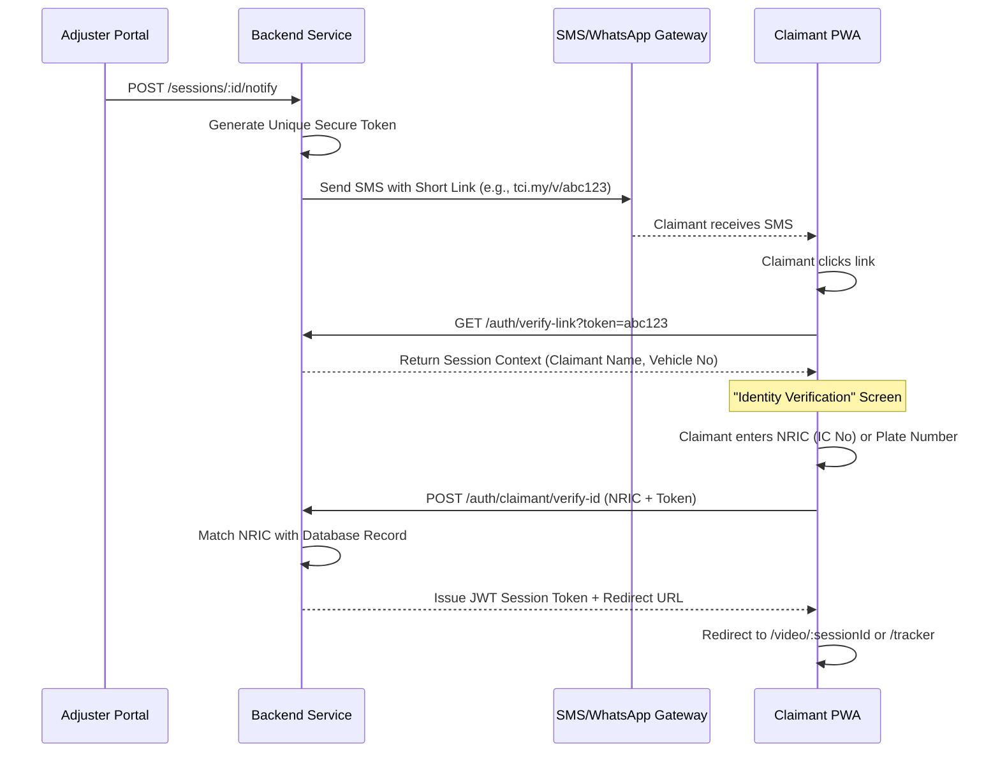

# Magic Link + ID Flow (Malaysian Insurance Market)

This document describes the low-friction, secure "Magic Link + ID" authentication flow designed specifically for the Malaysian insurance claim process.

## 1. Overview
Traditional account-based login (Email/Password) often creates a friction point for claimants who are using the application as a one-time utility during a stressful event. The "Magic Link + ID" flow provides secure access without registration.

## 2. Sequence Diagram

## 3. Core Components

### A. Adjuster Portal (The Initializer)
*   **Trigger**: Adjuster clicks "Send Video Invitation" or "Share Case Link".
*   **Payload**: The claimant's phone number as verified in the claim record.
*   **Security**: The action is only available to the assigned adjuster or insurer staff.

### B. Backend (The Generator)
*   **Token**: A crypthographically secure, time-limited token (e.g., UUID or JWE).
*   **Persistence**: Token is stored in the database/Redis, linked to the `claimId` and `sessionId`.
*   **Notification**: Integration with SMS providers (e.g., Twilio, Infobip) or WhatsApp Business API.

### C. Claimant PWA (The Utility)
*   **Landing**: The claimant lands directly on the verification gate.
*   **Verification (The "ID" part)**: The claimant provides a piece of info only they would know (last 4 digits of NRIC or the full Vehicle Plate Number).
*   **Statelessness**: No permanent account is created. The JWT token issued allows access only to the context of the specific claim linked to the token.

## 4. Key Advantages (Malaysian Context)
*   **Standard Identity**: NRIC is the primary identifier in Malaysia, making it natural for claimants to use for verification. 
*   **High Completion Rate**: By removing "Sign Up" and "Email verification," the time-to-video-call is reduced significantly.
*   **Secure Forwarding Protection**: If the SMS is accidentally forwarded, the recipient cannot enter the session without the specific claim ID (NRIC/Plate).

## 5. Implementation Roadmap
1.  **Backend**: Implement `/auth/verify-link` and `/auth/claimant/verify-id` endpoints.
2.  **Adjuster Portal**: Add the "Send Invite" action to the Claim Detail page.
3.  **Claimant PWA**: Create the `VerifyIdPage` component to handle the link token and NRIC input.

---
*True Claim Insight - Malaysia Market Strategy*
