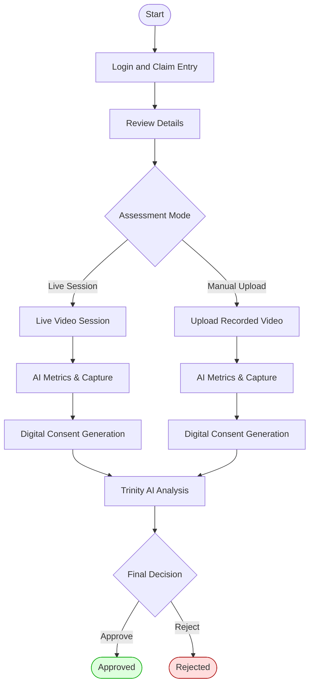
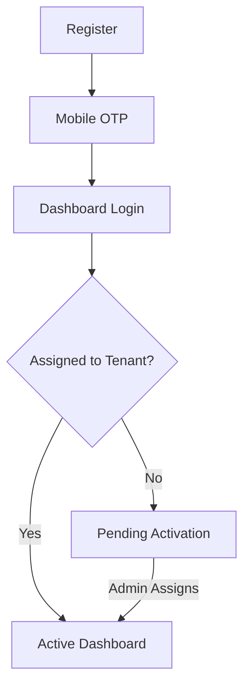
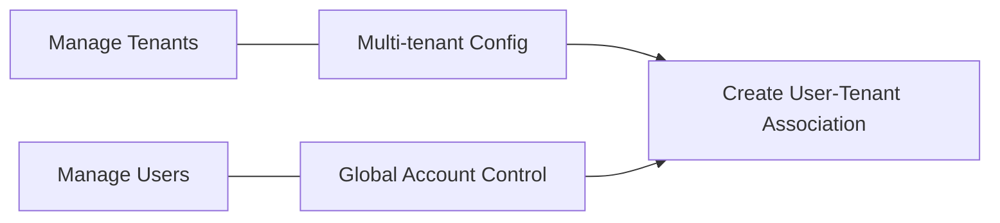
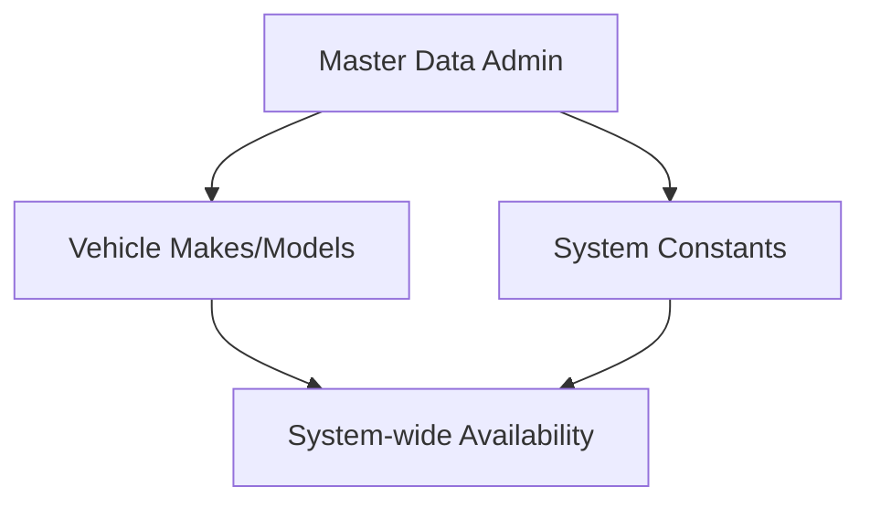
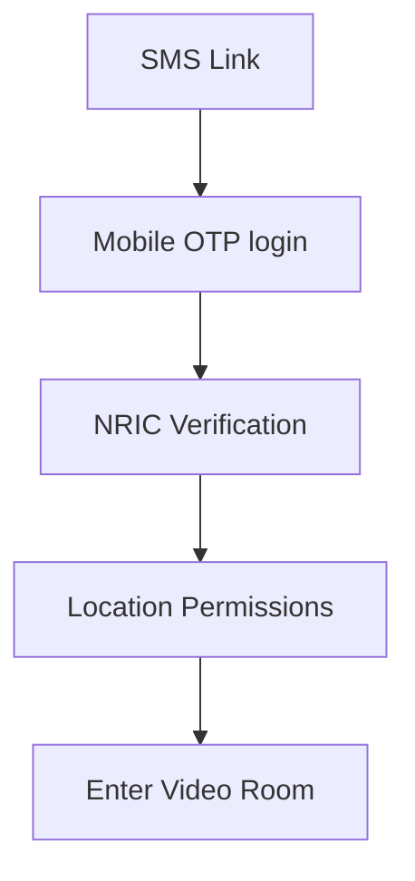

# True Claim Insight - System User & Demo Guide

This guide provides step-by-step instructions for using the platform, including demo account details, key user flows, and role-based walkthroughs.

---

## 🔐 Demo Credentials

Use these credentials to explore the system in the development environment.

| Role                       | Username / Email         | Password       | Tenant            |
| :------------------------- | :----------------------- | :------------- | :---------------- |
| **Super Admin**            | `superadmin@tci.com`     | `DemoPass123!` | System-wide       |
| **Firm Admin (Adjusting)** | `admin@pacific.com`      | `DemoPass123!` | Pacific Adjusters |
| **Adjuster**               | `adjuster@pacific.com`   | `DemoPass123!` | Pacific Adjusters |
| **Firm Admin (Insurer)**   | `admin@allianz.com`      | `DemoPass123!` | Allianz Insurance |
| **SIU Investigator**       | `siu@allianz.com`        | `DemoPass123!` | Allianz Insurance |
| **Compliance Officer**     | `compliance@allianz.com` | `DemoPass123!` | Allianz Insurance |
| **Support Desk**           | `support@allianz.com`    | `DemoPass123!` | Allianz Insurance |
| **Shariah Reviewer**       | `shariah@allianz.com`    | `DemoPass123!` | Allianz Insurance |
| **Claimant**               | `+60123456789`           | _OTP-based_    | N/A               |

---

## 🚀 Getting Started

### Access Points

- **Adjuster Portal**: [http://localhost:4000](http://localhost:4000) (For all staff roles)
- **Claimant PWA**: [http://localhost:4001](http://localhost:4001) (For insurance claimants)

---

## 🛠️ Key User Workflows

### a) Adjuster Assessment Workflow (End-to-End)

This workflow covers the daily operations of a Loss Adjuster.

1.  **Login & Case Entry**: Adjuster logs in and can either **Create a New Claim** or enter an **Existing Claim** from the dashboard.
2.  **Claim Review**: Within the claim, the adjuster can view:
    - **Claim Details**: Policy info, incident location, and vehicle data.
    - **Documents**: Police reports, damage photos, and evidence files.
    - **Claimant Info**: Profile, contact details, and eKYC status.
    - **Client Info**: Insurer/Tenant and geolocation details.
    - **Session Metrics**: Data from previous assessments and risk summaries.
3.  **Conducting Assessment**:
    - **Live Session**: Initiate a real-time video call via the portal.
    - **Manual Upload**: Alternative flow for uploading offline videos.
4.  **In-Session Interaction (Live)**:
    - **Deception Metrics**: Toggle "Deception Metrics" to see real-time risk indicators from the **Trinity AI Engine** (voice stress, micro-expressions).
    - **Evidence Capture**: Capture a **Claimant Screenshot** or photo of damage during the live session.
5.  **Assessment Completion**:
    - When ending the session, an automated **Consent Form** is generated for the claimant to sign digitally.
    - **Trinity Intelligence** triggers "True Claim" document extraction (OCR) and automated cross-checks.
6.  **Final Analysis & Decision**:
    - The system provides a **Final Analysis Reasoning** with a recommended action based on AI findings and risk scores.
    - The user reviews the summary and decides to **Approve** or **Reject** the claim.

### b) New User Registration & Onboarding

1.  **Register**: New users can register their account on the portal.
2.  **Mobile Verification**: Verify the mobile number using a **One-Time Password (OTP)**.
3.  **Authentication**: Login to the dashboard.
4.  **Onboarding State**:
    - **Pending Page**: If the user has not been assigned to a tenant organization yet, they see a "Account Activation Pending" page.
    - **Active Dashboard**: The portal becomes available once the tenant organization is setup and the user-tenant association is created.

### c) Superadmin Management Flow

Superadmins have full control over the platform's multi-tenant structure.

1.  **Tenant Management**: Add or modify new **Tenant**.
2.  **User Management**: Add or modify users across the entire system.
3.  **Associations**: Setup and manage the **User-Tenant Associations**, linking users to their respective tenants.

### d) Master Data Setup (Admin/Superadmin)

Maintaining the core system configurations.

1.  **Vehicle Master Data**: Admins and Superadmins can setup and modify the list of **Vehicle Makes and Models**.
2.  **System Constants**: Maintain standardized lookup values used throughout the claim assessment process.

### e) Claimant Assessment Workflow

This workflow describes the claimant's experience accessing the assessment.

1.  **Access Link**: Claimant opens the assessment link received via SMS.
2.  **Login & Verify**:
    - If not already logged in, enter the registered mobile number.
    - Verify using the **One-Time Password (OTP)** sent to the mobile.
3.  **Identity Confirmation**:
    - Confirm that the logged-in mobile number is correct.
    - Verify the registered **National Registration Identity Card (NRIC)** number.
4.  **Permissions**:
    - Enable **Location Permissions** (GPS) on the device to proceed. This is mandatory for verification and compliance.
5.  **Enter Assessment**: Join the **Video Room** for the live assessment with the adjuster.

---

_Last Updated: 2026-03-03 | True Claim Insight_
