# User flows — True Claim Insight as a TPA

Every diagram here is drawn from the code, not from intent. State machines
mirror `CASE_STATUS_TRANSITIONS` (`apps/case-service/src/cases/cases.service.ts`),
`CLAIM_STATUS_TRANSITIONS` (`apps/case-service/src/claims/claim-transitions.ts`)
and the Prisma enums. Where a step is planned rather than built it is marked
**(planned)**, so this document cannot become the false comfort §3.6 warns about.

Read `MASTER_PLAN.md` §2 for the narrative these diagrams formalise.

---

## 1. The whole journey, end to end

Five intake channels converge on one Case funnel; a vetted Case converts to a
Claim, which is the regulated engagement.

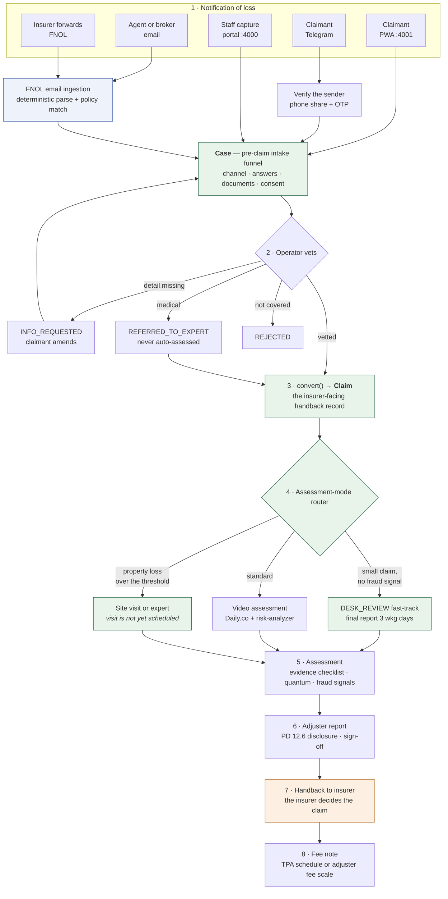

> **The firm recommends; the insurer decides.** Nothing in this system settles a
> claim. Step 7 is a handback, and the adjuster report says so on its face.

> **Step 4 decides how the claim is examined.** Four conditions must all hold
> for desk review, and the mode is disclosed in the report as a PD 12.6
> *method* — "desk review on documents alone" and "site inspection" reach the
> same figure by different means.

---

## 2. Case intake — the exact state machine

Transitions below are the whole of `CASE_STATUS_TRANSITIONS`. Anything not drawn
is refused server-side.

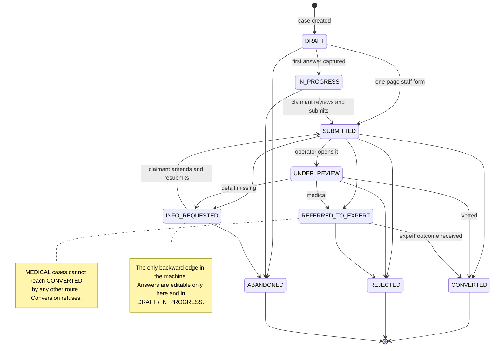

---

## 3. Claimant submits a case

The conversational intake: one question at a time, resumable via
`currentStepId`, with the flow chosen by travel claim type.

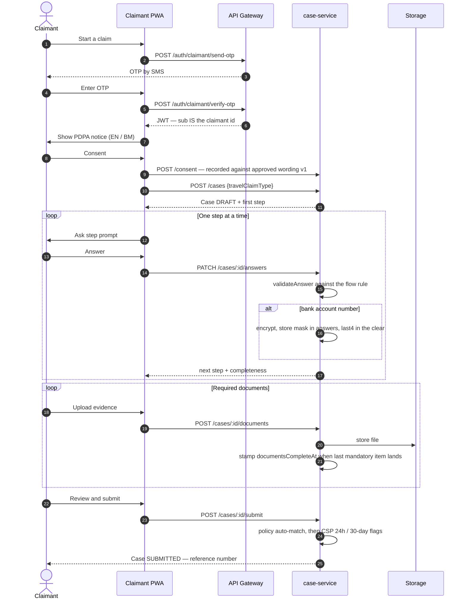

**Two flags computed at submission, both advisory at intake:** `notifiedLate`
(notified more than 24 hours after the incident) and `outOfWindow` (more than 30
days). They surface as warnings to the operator; they never auto-reject.

---

## 4. Operator vetting, and the request-for-information loop

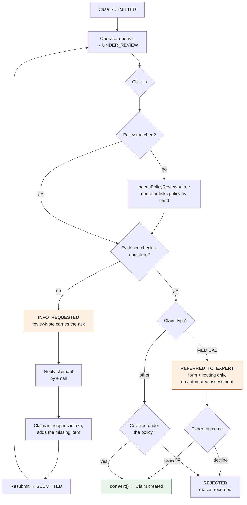

The loop `INFO_REQUESTED → SUBMITTED → UNDER_REVIEW` may run any number of
times. Every pass writes an audit row with before/after values.

---

## 5. Insurer-appointed entry — the Assignment

Where the regulated engagement actually begins. Under TPA operation a Case
converts to a Claim; under insurer appointment the Assignment comes first and
the Case is optional.

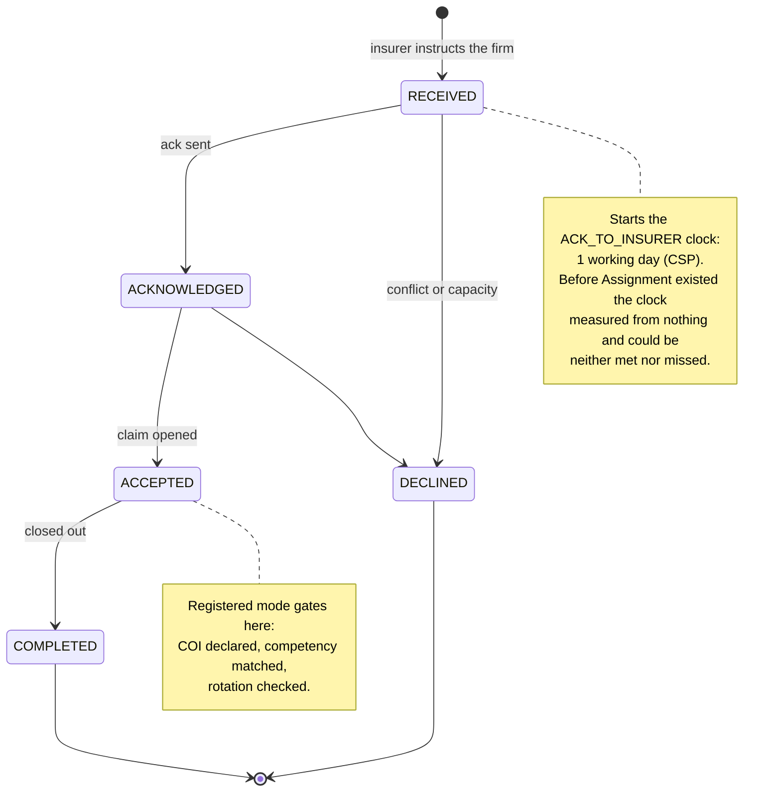

> **The acknowledgement is now sent, not just recorded.** Acknowledging emails
> the appointing contact and stops the CSP clock in the same act, so the
> one-working-day obligation is discharged by the system rather than by
> remembering.

---

## 6. Claim lifecycle — the exact state machine

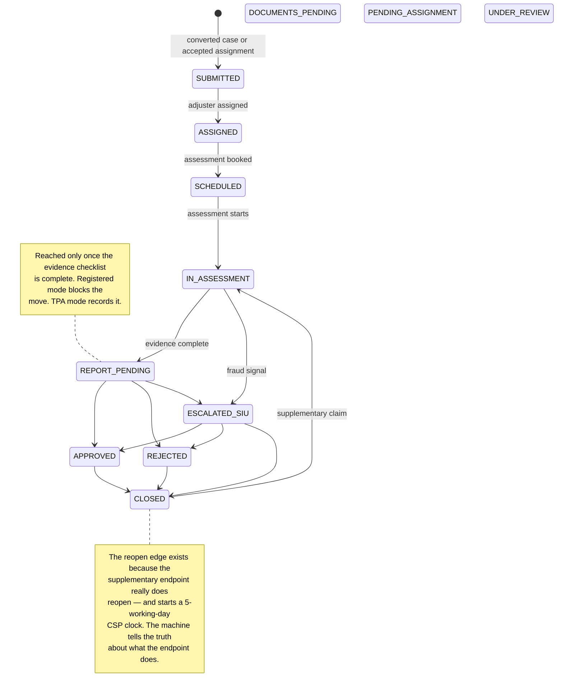

Every claim state may also go straight to `CLOSED`, `APPROVED` or `REJECTED`
from the early states — an insurer can withdraw at any point.

> ⚠️ **Three statuses exist but nothing reaches them.** `DOCUMENTS_PENDING`,
> `PENDING_ASSIGNMENT` and `UNDER_REVIEW` are defined in `ClaimStatus` and shown
> above detached, because no transition leads to any of them. A recorded Phase 1
> lifecycle gap, pinned by a test so it cannot be quietly forgotten.

---

## 7. Adjuster assessment and report sign-off

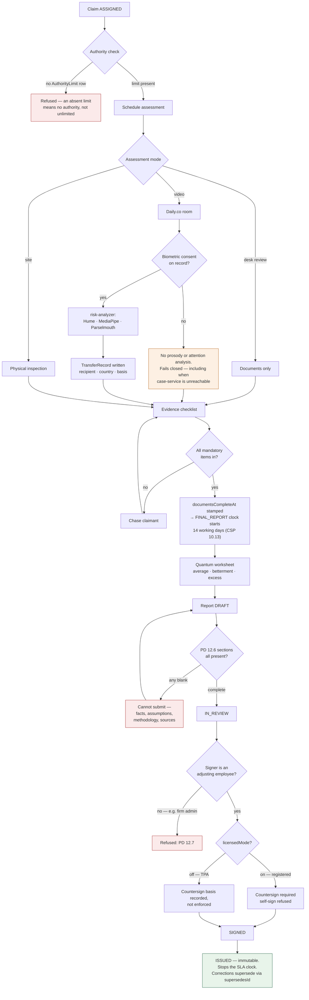

**The report cites a worksheet revision.** Creating a report pre-fills the
PD 12.6 quantum section from the current worksheet and records which revision it
used, so the figure and its workings cannot silently diverge. A draft citing a
superseded revision reports itself as outdated; an issued report keeps the figure
it was signed against.

**Segregation of duties (A3):** the assessor cannot decide their own claim
unless an `AuthorityLimit` expressly permits it, and never above its monetary
ceiling. The basis is written onto the audit row.

---

## 8. CSP clocks running underneath

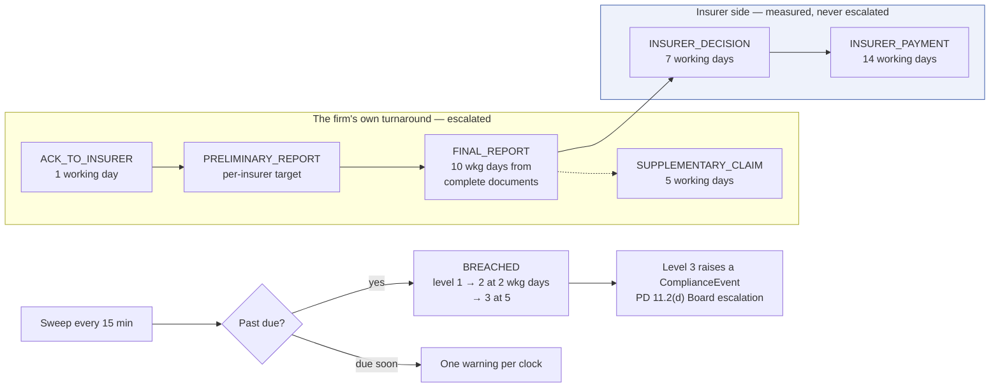

`monitorOnly` stages are the insurer's delay, not the firm's: measured so the
firm can evidence where a delay originated, never escalated against it.

**The escalation now reaches a person** — a firm-owned breach emails the
operations address, deduplicated per clock and per level so a breach left open
over a weekend sends once rather than every fifteen minutes.

---

## 9. FNOL email ingestion

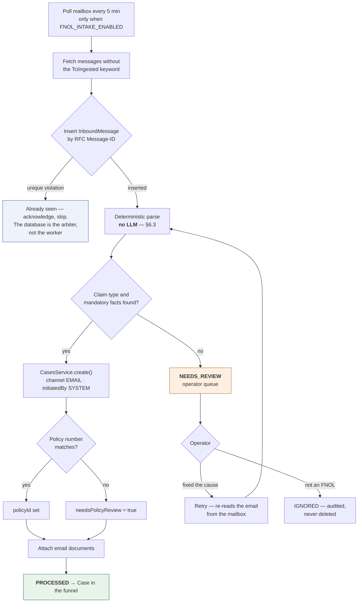

The operator queue is now a screen — *FNOL intake* in the portal, with
`NEEDS_REVIEW` and `FAILED` leading the filters. Until it existed, the row was
written and nobody could see it.

The row is written **before** parsing, so an email nobody could understand still
leaves a trace. A claimant who emailed you believes they have notified you.

---

## 10. Small-claims fast-track

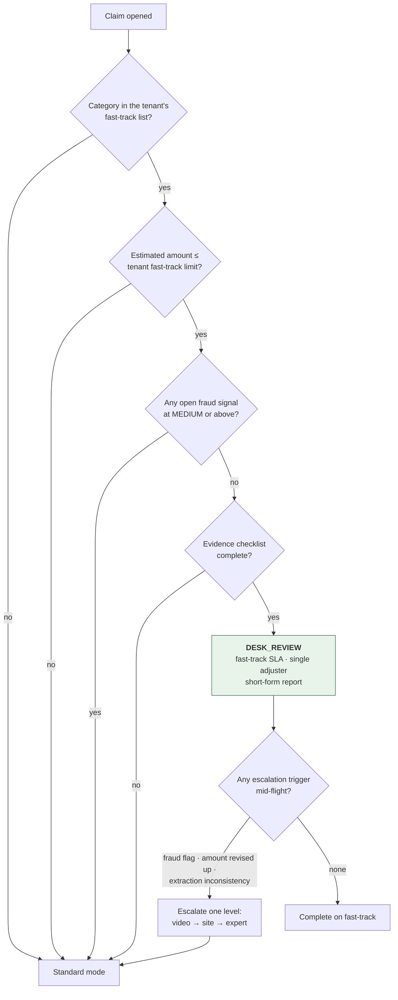

> **The thresholds are the firm's, set per tenant.** Categories and per-category
> ceilings live in firm configuration, alongside licensed mode and the
> working-day calendar — so a white-labelled insurer's claims are routed on that
> insurer's rules rather than a platform default.

> **Configuration gaps fail closed.** A category with no limit configured is not
> fast-tracked, and an unknown estimated amount is not treated as a small one.
> Medical is excluded ahead of the economic checks, so a small medical claim
> cannot slip through on value.

Mode changes are audited and disclosed in the report's methodology section
(PD 12.6) — the assessment mode is a *method*, and a reader is entitled to know
which one produced the figure.

---

## 11. Who may do what

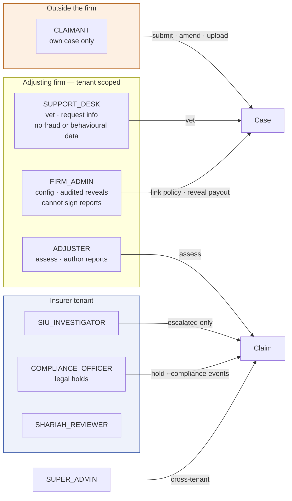

Cross-tenant access raises `ForbiddenException`. A record belonging to another
tenant is indistinguishable from one that does not exist — an existence check,
not merely an access check.

---

## What is drawn here but not yet built

| Flow step | Status |
|---|---|
| Policy file feed from the insurer | Planned, gated on **G9** |
| Proactive flight-delay detection | Needs G9 data plus a WhatsApp channel |
| Local-LLM document validation | `validationStatus` is a labelled stub |
| AMLA/CTF screening at payee registration | Phase 5, the one **FAIL** in §3 |
| Site-visit **scheduling** | The router now sends a property loss over the firm's threshold to `SITE_VISIT` (MASTER_PLAN §2.4), but nothing schedules the visit, holds an appointment or tells the claimant when someone is coming |
